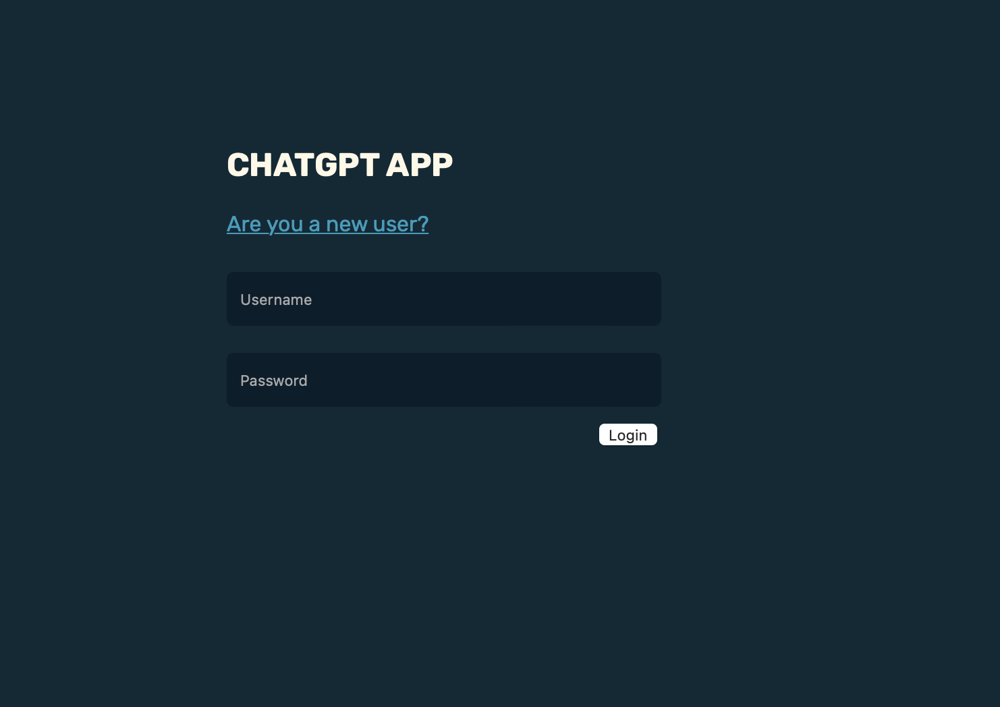
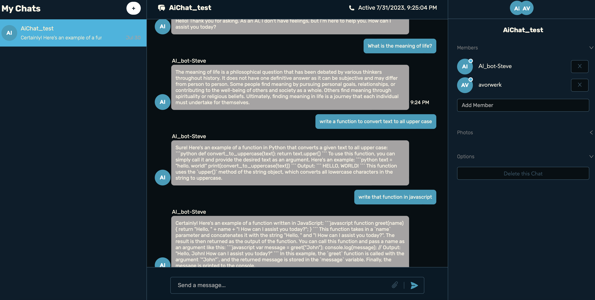
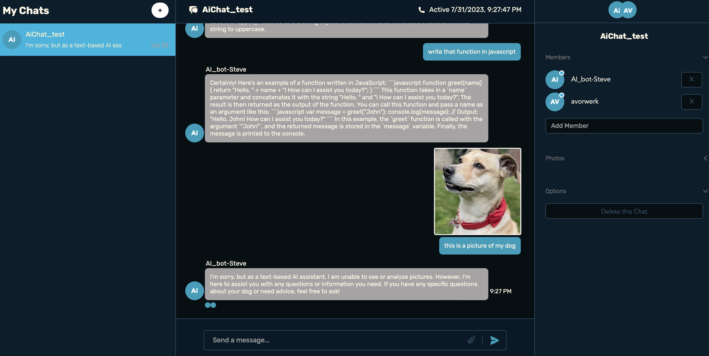

# av-chat-app
## Description
# ChatGPT Powered Chat App
This app uses the OpenAi API to create a chat app with automatically generated responses. Full stack, React, Redux Toolkit, Node, OpenAI

## How to Run
<ul>
  <li>1. Download or clone this repository </li>li>
  <li>2. Cd into both the client and server directories and run npm install</li>
  <li>3. Create the necessary Chat Engine and OpenAi accounts to generate your own personal API keys</li>
  <li>4. Run npm run dev on both the client and server sides</li>

## Images

## Roadmap
Update the CSS to give it a more user friendly feel. Deploy on Vercel or similar.
